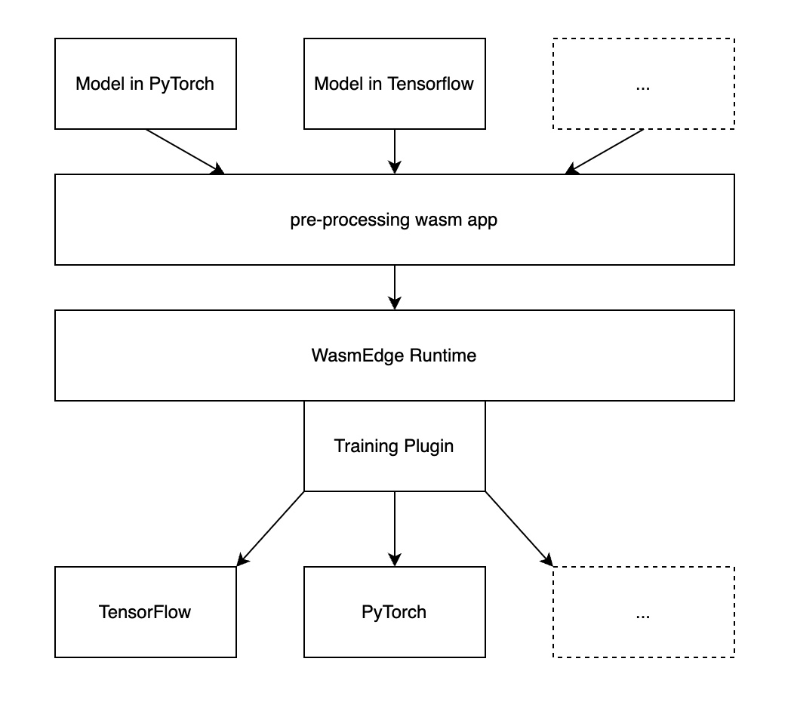

# WasmEdge Runtime Plugin for Training NN Models

## Introduction

> This is an experimental project in the very early stage. 

The goal of this project is to explore the feasibility of providing AI training capability for WasmEdge Runtime. It is built up as a plugin. The rudimentary architecture of this project is shown as below:

  

## Examples

In the current stage, three examples are provided: one is PyTorch model, the others are TensorFlow models. The models are defined with PyTorch/TensorFlow Python APIs, while the training is done on WasmEdge Runtime via the `wasmedge-nn-training` plugin.

- Example 1: [Training a linear regression model (TensorFlow)](examples/tensorflow/custom-model/)

- Example 2: [Training a custom model (TensorFlow)](examples/tensorflow/regression/)

- Example 3: [Training Resnet model (PyTorch)](examples/pytorch/resnet-pytorch/)
